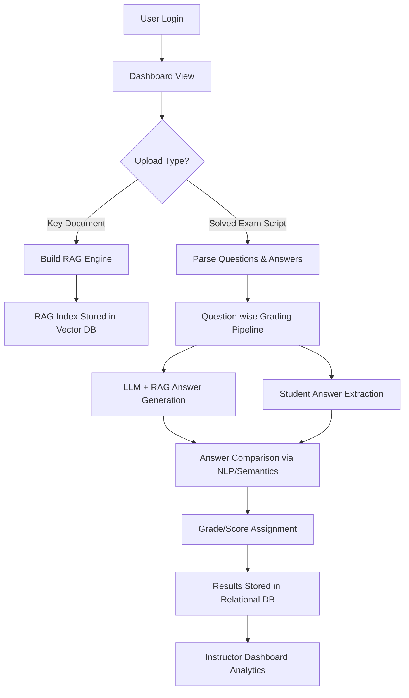

# Architecture

GradeMate is a full-stack web application built with **Django** and **React**, designed to automate the grading of descriptive and short-answer exam scripts using **LLMs**, **RAG (Retrieval-Augmented Generation)**, and **semantic NLP techniques**.

## Overview

GradeMate allows instructors to upload marking schemes or related documents (keys), which are used to construct a **custom RAG pipeline** for each exam. When a student’s solved paper is uploaded, each question is evaluated by comparing the **LLM-generated ideal answer** (based on the RAG engine) with the **student's actual answer**, assigning grades using semantic similarity, contextual understanding, and NLP metrics.


## Workflow Overview




##  Component Architecture

```
                   ┌──────────────────────────────┐
                   │     Frontend (React + Vite)  │
                   │  - Dashboard & Upload Forms  │
                   │  - Result Visualizations     │
                   └─────────────┬────────────────┘
                                 │
                                 ▼
                   ┌──────────────────────────────┐
                   │ Backend (Django + DRF)       │
                   │ - Auth, API, Logic Handling  │
                   └─────────────┬────────────────┘
                                 │
        ┌────────────────────────┼────────────────────────┐
        ▼                        ▼                        ▼
┌────────────────┐   ┌──────────────────────┐   ┌─────────────────────┐
│Vector Database │   │    RAG Engine        │   │ Relational Database │
│ (FAISS/Chroma) │   │ - Query Expansion    │   │  (SQLite/PostgreSQL)│
└────────────────┘   │ - Self RAG           │   └─────────────────────┘
                     │ - LLM Prompting      │
                     └──────────────────────┘
```

## Detailed Flow: Key to Grade

### Step 1: User Login & Dashboard

- Authenticated via Django.
- Dashboard shows analytics like:
  - Total scripts graded
  - Books/keys used to build RAGs
  - Average scores, grading status

### Step 2: Upload Key Document

- User uploads reference material (textbook, marking key).
- Embeddings generated (e.g., Sentence-BERT).
- Stored in **Vector DB**.
- A custom **RAG engine** is built for this document set.

### Step 3: Upload Solved Exam Script

- PDF/Doc file uploaded.
- Extracts question-answer pairs.
- For each question:
  - Sends query to **RAG engine** → Generates ideal answer via **LLM**
  - Compares with student answer using:
    - Semantic similarity
    - Keyword overlap
    - Contextual accuracy

### Step 4: Score Assignment

- Marks assigned per question.
- Optional rubric can be used for structured evaluation.
- Results stored in DB and shown in UI.

##  AI/NLP Components

| Component              | Description                                              |
|------------------------|----------------------------------------------------------|
| Embedding Model        | Converts key content and answers into vectors            |
| RAG (Retrieval-Augmented) | Finds most relevant content for each question         |
| LLM (GPT/Claude/etc.)  | Generates ideal answers using retrieved context          |
| Answer Comparator      | Measures similarity via NLP metrics & semantic analysis  |
| Grade Generator        | Calculates final marks with optional rubric support      |


##  Dashboard View

- 📈 **Total Papers Graded**
- 📘 **Books/Keys Uploaded**
- 📑 **Per-Question Analysis**


