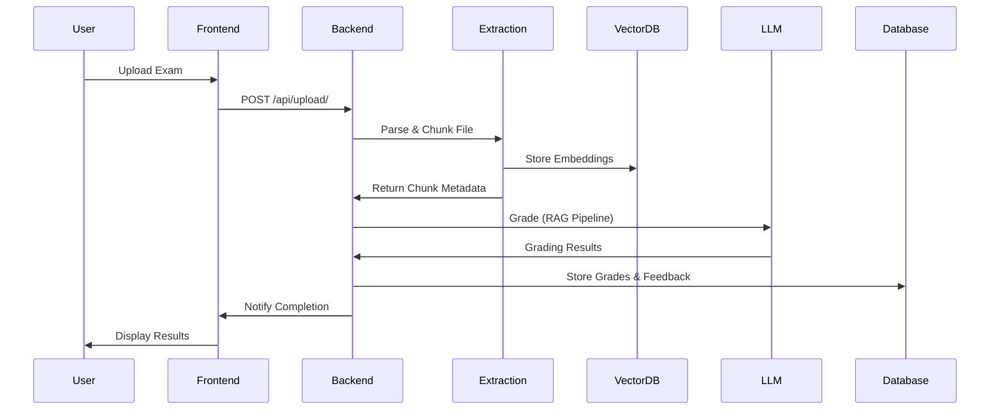

# Sequence Diagram

```mermaid
sequenceDiagram
    participant User
    participant Frontend
    participant Backend
    participant Extraction
    participant VectorDB
    participant LLM
    participant Database

    User->>Frontend: Upload Exam
    Frontend->>Backend: POST /api/upload/
    Backend->>Extraction: Parse & Chunk File
    Extraction->>VectorDB: Store Embeddings
    Extraction->>Backend: Return Chunk Metadata
    Backend->>LLM: Grade (RAG Pipeline)
    LLM->>Backend: Grading Results
    Backend->>Database: Store Grades & Feedback
    Backend->>Frontend: Notify Completion
    Frontend->>User: Display Results
```

